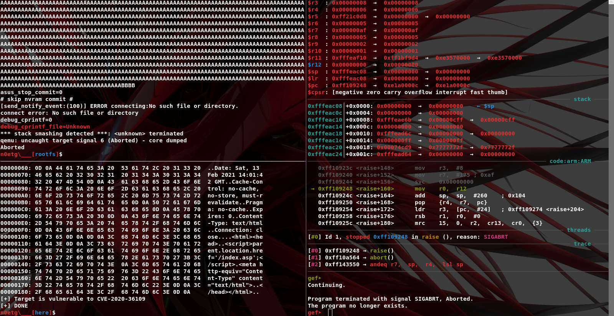

# CVE-2020-36109-POC
> Feb 13 2021, Altin Thartori, github.com/tin-z

---

## Vulnerability details ##
ASUS RT-AX86U router firmware below version under 9.0.0.4_386 has a buffer overflow in the blocking_request.cgi function of the httpd module that can cause code execution when an attacker constructs malicious data.

The vulnerability is not only present in RT-AX86U but also in other models using httpd service. [details](#more-details)

references:
 * [nist report](https://nvd.nist.gov/vuln/detail/CVE-2020-36109)
 * [cvebase](https://www.cvebase.com/cve/2020/36109)


## Exploit details ##

The vulnerability does not permit us to achieve RCE, in fact, only DoS was achieved.
In first place because of the canary, and secondly because 'strcat' does not copy NULL bytes and then we cannot overwrite canary nor craft ROP.
And also the buffer was placed just below the canary.

Prerequisites:
 - The target should have the same time zone, otherwise change the PoC
 - The value of 'Referer' header should contain the target's address
 - 'mac' parameter value must be equal to 'MULTIFILTER_MAC' nvram value 

<p align="center"></p>

### PoC ###
  * [poc.py](./poc.py)



### more details ###
```
Table 1. Versions of the vulnerable asus routers

| Model                   | Version           | date 
-------------------------------------------------------------------
| RT-AX86U                | 3.0.0.4.384.9318  | 2020/10/23
| ROG Rapture GT-AC5300   | 3.0.0.4.384.81974 | 2020/07/13 
| ROG Rapture GT-AX11000  | 3.0.0.4.384.9566  | 2020/08/06 

 ...                        ,,,                         ,,,

```


